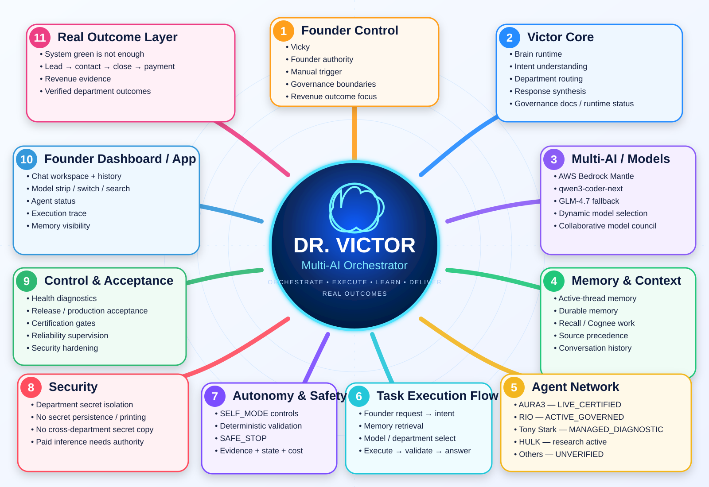

# Dr. Victor Multi-AI Orchestrator

<p align="center">
  
</p>

**Central manager** · Founder: Vicky · Leader: Dr. Victor
**Backcheck:** 22 Aug 2026 → see [BACKCHECK_REPORT.md](BACKCHECK_REPORT.md)

Vicky judges Victor by **verified department final outcomes and collected revenue**, not “system green”. Revenue truth is recorded in `data/revenue_outcomes.json` and validated through the full lead → contact → close → payment funnel.

**Lead contacts:** WhatsApp 8287900789 · info@designinfra.in · IG designinfra.interiors

## Current organization

```
Vicky (Founder)
  └── Dr. Victor (Grok) — Orchestrator
        ├── AURA3        LIVE_CERTIFIED
        ├── AURA2        HOLD
        ├── RIO          ACTIVE_GOVERNED
        ├── Tony Stark   MANAGED_DIAGNOSTIC
        ├── HULK         research mandate active; connection unverified
        └── Other registered departments remain UNVERIFIED
```

## Isolation
- Secrets stay **in that department repo only**. No cross connections.
- AURA2 ≠ Vision. Do not mix Instagram interiors with YouTube drama.

## Extra repos (not chart)
`designinfra-site` · `design-infra-marketing` · `youtube-shorts-automation` · `Instagram-content` · `legion-x` · `skills-for-architects` (empty)

Canonical department status comes from `data/department_registry.json` reconciled with department contracts and fresh runtime evidence. Static planning text must not override it.

## Cost
Governed cost controls apply in SELF_MODE; credential administration is the only per-action Founder approval gate.
